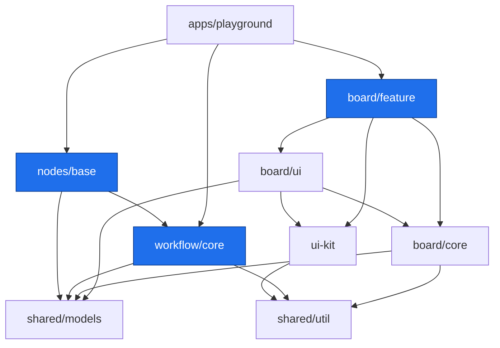

# Architecture

Документ описывает целевую архитектуру монорепозитория **Pipeline Editor**: домены,
слои библиотек, модель данных холста, движок исполнения пайплайнов и границы модулей.

> Статус: репозиторий очищен от демонстрационного кода (шаблон Nx «shop»). Ниже —
> целевая структура, к которой мы приходим. Библиотеки создаются генераторами Nx
> по мере разработки (см. раздел [Генерация](#генерация-библиотек)).

---

## 1. Цель и принципы

Итоговый артефакт репозитория — набор **публикуемых Angular-библиотек**, из которых
внешнее приложение собирает редактор пайплайнов AI-агентов. Приложение `playground`
существует только для локальной разработки и не публикуется.

Принципы:

1. **Разделение «редактор ↔ бизнес».** Холст (рисование, навигация, редактирование графа)
   ничего не знает о том, что реально делают узлы. Исполнение и интеграции живут в
   отдельном домене, вдохновлённом [n8n](https://n8n.io) (реестр типов узлов + движок).
2. **Слоистость.** Каждая библиотека имеет один из типов: `model → util → core → ui → feature`.
   Зависимости идут только «сверху вниз». Это гарантируется тегами и
   `@nx/enforce-module-boundaries` (см. [§7](#7-границы-модулей)).
3. **Presentational-компоненты в `ui`, состояние в `core`.** UI-компоненты «глупые»
   (`input()/output()`, `ChangeDetectionStrategy.OnPush`), состояние — в signal-сторах слоя `core`.
4. **Модель данных — единый источник правды.** И редактор, и движок оперируют одной
   сериализуемой моделью пайплайна из `shared/models`.
5. **Всё через Nx.** Сборка, тесты, линт, релиз — только `nx run/run-many/affected`.

---

## 2. Домены

| Домен        | scope-тег        | Назначение                                                                |
| ------------ | ---------------- | ------------------------------------------------------------------------- |
| **board**    | `scope:board`    | Холст: модель графа для рендера, viewport, навигация, узлы, рёбра, сетка. |
| **workflow** | `scope:workflow` | Бизнес: движок исполнения пайплайна и каталог интеграций (узлов).         |
| **shared**   | `scope:shared`   | Общие модели данных, утилиты и переиспользуемый UI-kit.                   |
| **app**      | `scope:app`      | Host-приложение(я): `playground`.                                         |

Домен **board** отвечает на вопрос «как это выглядит и как этим управляют мышью».
Домен **workflow** — «что узел на самом деле делает при запуске». Связывает их
общая сериализуемая модель пайплайна.

---

## 3. Карта библиотек

```
apps/
  playground/                 @scope:app  type:app        host-приложение (nx serve)

packages/
  shared/
    models/                   @tsai-pe/shared/models   scope:shared type:model
    util/                     @tsai-pe/shared/util     scope:shared type:util
    theme/                    @tsai-pe/shared/theme    scope:shared type:util   ← Tailwind tokens + global CSS
  ui-kit/                     @tsai-pe/ui-kit          scope:shared type:ui     ← Angular Aria + Tailwind

  board/
    core/                     @tsai-pe/board/core      scope:board  type:core
    ui/                       @tsai-pe/board/ui        scope:board  type:ui
    feature/                  @tsai-pe/board/feature   scope:board  type:feature   ← публичный редактор

  workflow/
    core/                     @tsai-pe/workflow/core   scope:workflow type:core     ← движок исполнения
  nodes/
    base/                     @tsai-pe/nodes/base      scope:workflow type:core     ← каталог интеграций
```

Публичный npm-scope библиотек — **`@tsai-pe`**.

### Граф зависимостей



Ключевое: **`board/*` и `workflow/*` не зависят друг от друга напрямую** — только через
`shared/models`. Редактор можно собрать без движка, движок можно запускать headless без редактора.

---

## 4. UI-kit и стилизация

### 4.1 ui-kit на Angular Aria (type:ui)

Переиспользуемые компоненты (кнопки, поля, селекты, меню, табы, аккордеоны,
тултипы, панели свойств узла) строятся на **[Angular Aria](https://angular.dev/guide/aria/overview)**
(`@angular/aria`) — наборе **headless** доступных директив, реализующих паттерны
WAI-ARIA (клавиатура, фокус, ARIA-атрибуты, скринридеры) **без визуальных стилей**.

Используем примитивы: `Listbox`/`Select`/`Multiselect`/`Combobox`/`Autocomplete`
(выбор типа узла, параметры), `Menu`/`Menubar`/`Toolbar` (контекстные меню, тулбар
холста), `Tabs`/`Accordion` (панель инспектора), `Tree`/`Grid` (навигатор пайплайна).
Всю вёрстку и стили даём свои — через Tailwind + токены темы. Так ui-kit остаётся
доступным «из коробки», но полностью в нашем визуальном языке.

### 4.2 @angular/cdk

`@angular/cdk` подключаем для инфраструктурных примитивов, которых нет в Aria:

- **Overlay** — позиционирование поповеров, меню, тултипов, floating-панелей над холстом.
- **Portal** — вынос содержимого (например, панели свойств) в overlay-контейнер.
- **Virtual Scroll** (`cdk-virtual-scroll-viewport`) — длинные списки: палитра узлов,
  логи выполнения, большие наборы параметров.
- **Drag & Drop** / **a11y** / **Layout** — вспомогательные утилиты по мере надобности.

Aria отвечает за поведение компонентов, CDK — за инфраструктуру (оверлеи, скролл, порталы).

### 4.3 Стили: Tailwind v4

Стилизуемся на **Tailwind v4** (CSS-first, без `tailwind.config.js`). Единый вход и
токены живут в `@tsai-pe/shared/theme`:

- `theme.css` — дизайн-токены как CSS-переменные (единый источник правды; годятся и
  для inline-стилей рендера рёбер/портов на холсте).
- `index.css` — `@import "tailwindcss"`, маппинг токенов в `@theme`
  (утилиты `bg-surface-1`, `text-text-2`, `rounded-md`, `shadow-elev-2`…), базовый
  слой и хелперы холста (`.board-grid`, `.glass`, `.grain`).

Подключение в монорепо (в `styles.css` приложения):

```css
@import '@tsai-pe/shared/theme';
@source '../../../packages/board'; /* сканирование классов из библиотек */
@source '../../../packages/ui-kit';
```

Angular-билдер (`@angular/build`) обрабатывает Tailwind через корневой
`.postcssrc.json` (`@tailwindcss/postcss`); Vite-превью/тесты — через
`@tailwindcss/vite`. Библиотеки собственного Tailwind-шага не требуют: их классы
подхватывает сканирование приложения (`@source`). Опционально авто-`@source` для
всех зависимостей — генератором `@juristr/nx-tailwind-sync`.

### 4.4 Тема

Тема — своя (Angular Aria theme-agnostic), собрана по дизайн-принципам «premium/
technological» (Linear/Vercel × Apple glass):

- **Dark-first**, единый акцент — электрический индиго `#7C5CFF`; ~90% нейтрального
  near-black, границы — hairline-бордеры, а не тени.
- **Роли узлов** кодируются приглушёнными тинтами (`--role-trigger` emerald,
  `--role-middleware` indigo, `--role-result` blue) и применяются минимально —
  2px-рейл, точка порта, иконка; тело узла остаётся нейтральным.
- **Light-тема** — зеркало тех же токенов (`class="light"` на `<html>`), dark по умолчанию.

Границы: `ui-kit` и `shared/theme` имеют `scope:shared` — их могут использовать все
домены; сами они не зависят ни от `board`, ни от `workflow`.

---

## 5. Домен board (холст)

Отвечает за визуальное редактирование графа пайплайна. Разбит на три слоя.

### 4.1 `board/core` — состояние и логика (type:core)

Чистая TS-логика + Angular signals, без шаблонов. Здесь живёт «мозг» холста:

- **Scene / graph store** — сигнальное состояние: узлы, рёбра, выделение. Источник —
  модель из `shared/models`, спроецированная в удобный для рендера вид (позиции, размеры, состояние).
- **Viewport** — трансформация холста: смещение `{ x, y }` (pan) и масштаб `scale` (zoom).
  Преобразования координат `screen ↔ world`.
- **Navigation** — жесты: панорамирование (перетаскивание фона / средняя кнопка / `Space`+drag),
  масштабирование колесом относительно курсора, ограничения зума.
- **Interactions** — перетаскивание узлов, рисование соединения от порта к порту,
  прямоугольное выделение (marquee), hit-testing.
- **Selection** — одиночное/множественное выделение элементов.
- **Commands / history** — применение изменений к модели (add/move/connect/delete) с заделом под undo/redo.

Зависит от: `shared/models`, `shared/util`.

### 4.2 `board/ui` — presentational-компоненты (type:ui)

«Глупые» компоненты рендера, управляемые входами. Кандидаты (`OnPush`):

| Компонент           | Роль                                                                       |
| ------------------- | -------------------------------------------------------------------------- |
| `GridBackground`    | Бесконечный фон — **сетка точек 32×32**, реагирует на viewport (pan/zoom). |
| `NodeView`          | Визуал одного узла: заголовок, иконка, роль, порты, слот содержимого.      |
| `NodePort`          | Порт входа/выхода — точка привязки соединения (handle).                    |
| `Connection` (edge) | Ребро между портами — кривая Безье output → input.                         |
| `ConnectionPreview` | «Резиновое» соединение, тянущееся от порта к курсору при создании связи.   |
| `SelectionMarquee`  | Прямоугольник выделения.                                                   |
| `Minimap`           | Мини-карта холста (опционально).                                           |
| `BoardToolbar`      | Зум-контролы, «fit to screen», добавление узла (опционально).              |

**Подход к рендеру:** узлы — абсолютно спозиционированный DOM внутри контейнера с
CSS-`transform: translate() scale()` (viewport); рёбра — единый `SVG`-слой поверх/под узлами;
фон-сетка — CSS `radial-gradient` с `background-size: 32px 32px`, чей `background-position`
и размер связаны с viewport. DOM-узлы дают доступную вёрстку форм внутри узла; SVG удобен
для кривых Безье. (Полностью canvas-рендер держим как возможную оптимизацию на будущее.)

Зависит от: `board/core`, `ui-kit`, `shared/models`.

### 4.3 `board/feature` — собранный редактор (type:feature) · публичная точка

Компонент верхнего уровня `<pe-board>`: связывает стор из `board/core` с компонентами
`board/ui`, обрабатывает клавиатуру/мышь, отдаёт наружу события изменения пайплайна
(`pipelineChange`) и принимает модель (`pipeline`). Панели свойств узла собираются из `ui-kit`.
Это основной публикуемый артефакт редактора.

Зависит от: `board/ui`, `board/core`, `ui-kit`, `shared/models`.

---

## 6. Домен workflow + nodes (бизнес)

Headless-часть: описывает **что** делают узлы и исполняет пайплайн. Ориентир — n8n.

### 5.1 `workflow/core` — движок (type:core)

- **Реестр типов узлов** (`NodeTypeRegistry`) — по строковому `type` возвращает описание узла.
- **Описание типа узла** (`NodeType`, аналог `INodeType` в n8n): метаданные (имя, роль
  trigger/middleware/result, иконка, описание портов), схема параметров (используется `ui-kit`
  для авто-генерации формы настроек) и функция исполнения.
- **Движок исполнения** (`WorkflowRunner`) — топологический обход графа от триггеров к
  результатам, передача данных между узлами (`NodeExecutionData`), контекст выполнения,
  обработка ошибок.

Аналогии с n8n: `NodeType ≈ INodeType`, `NodeExecutionData ≈ INodeExecutionData`,
`WorkflowRunner ≈ WorkflowExecute`, `Connections ≈ IConnections`.

Зависит от: `shared/models`, `shared/util`.

### 5.2 `nodes/base` — каталог интеграций (type:core)

Конкретные реализации `NodeType`, сгруппированные по роли:

- **Triggers** — точки входа: `manual`, `webhook`, `schedule`, …
- **Middleware** — обработка: `http-request`, `transform`, `code`, `if`/branch, …
- **Results** — терминальные: `http-response`, `log`, `store`, …

Каждый узел экспортирует своё `NodeType` и регистрируется в `NodeTypeRegistry`.
Добавление интеграции = добавить файл-описание сюда, не трогая редактор и движок.

Зависит от: `workflow/core`, `shared/models`.

---

## 7. Границы модулей

Правила заданы в `eslint.config.mjs` (`@nx/enforce-module-boundaries`) и проверяются линтом.
Импорт разрешён, только если он проходит **и** scope-, **и** type-ограничения.

### Scope (кто какой домен видит)

| sourceTag        | может зависеть от                                            |
| ---------------- | ------------------------------------------------------------ |
| `scope:shared`   | `scope:shared`                                               |
| `scope:board`    | `scope:board`, `scope:shared`                                |
| `scope:workflow` | `scope:workflow`, `scope:shared`                             |
| `scope:app`      | `scope:app`, `scope:board`, `scope:workflow`, `scope:shared` |

### Type (слоистость)

| sourceTag      | может зависеть от                        |
| -------------- | ---------------------------------------- |
| `type:app`     | `feature`, `ui`, `core`, `util`, `model` |
| `type:feature` | `feature`, `ui`, `core`, `util`, `model` |
| `type:ui`      | `ui`, `core`, `util`, `model`            |
| `type:core`    | `core`, `util`, `model`                  |
| `type:util`    | `util`                                   |
| `type:model`   | `model`                                  |

Так, например, `ui-kit` (`scope:shared`, `type:ui`) технически может зависеть от `type:core`,
но scope-правило запрещает ему тянуть `board/core` (`scope:board`) — оба ограничения должны
выполняться одновременно.

---

## 8. Модель данных

Единая сериализуемая модель в `shared/models` — контракт между редактором и движком.

```ts
// shared/models — эскиз
export type NodeKind = 'trigger' | 'middleware' | 'result';

export interface Position {
  x: number;
  y: number;
}

export interface PipelineNode {
  id: string;
  type: string; // ключ в NodeTypeRegistry, напр. 'http-request'
  kind: NodeKind; // роль для рендера/валидации связей
  position: Position; // координаты в world-пространстве холста
  params: Record<string, unknown>; // значения параметров узла
}

export interface Connection {
  id: string;
  source: { nodeId: string; port: string }; // выходной порт
  target: { nodeId: string; port: string }; // входной порт
}

export interface Pipeline {
  id: string;
  name: string;
  nodes: PipelineNode[];
  connections: Connection[];
}
```

Правила связей (валидируются в `board/core`): `trigger` имеет только выход; `result` — только
вход; поток направлен `output → input`; циклы и дубли-связи запрещены.

---

## 9. Playground

`apps/playground` — минимальное Angular-приложение (`scope:app`, `type:app`). Монтирует
`<pe-board>`, подключает `nodes/base` в реестр `workflow/core` и служит стендом для ручной
проверки и e2e (Playwright). Не публикуется.

---

## 10. Сборка и релиз

- Библиотеки — **buildable** (Vite/Angular build), тесты на **Vitest**, линт на **ESLint**.
- Публичный API каждой библиотеки — только через `src/index.ts` (barrel). Никаких
  «глубоких» импортов между пакетами.
- Релиз через `nx release` (конфиг в `nx.json`: `release.projects = ["packages/*"]`,
  независимые версии, conventional-commits).

```bash
npx nx run-many -t build            # собрать все библиотеки
npx nx affected -t lint test build  # только затронутые (CI)
npx nx release                      # версионирование и публикация
```

---

## 11. Генерация библиотек

Библиотеки создаются генераторами Nx с корректными тегами. Ориентировочные команды:

```bash
# shared
npx nx g @nx/js:lib packages/shared/models --tags=scope:shared,type:model
npx nx g @nx/js:lib packages/shared/util   --tags=scope:shared,type:util
npx nx g @nx/js:lib packages/shared/theme  --tags=scope:shared,type:util   # tokens+CSS (уже есть src/)

# ui-kit + board (ui-kit опирается на @angular/aria + @angular/cdk)
npx nx g @nx/angular:lib packages/ui-kit        --tags=scope:shared,type:ui
npx nx g @nx/angular:lib packages/board/core     --tags=scope:board,type:core
npx nx g @nx/angular:lib packages/board/ui       --tags=scope:board,type:ui
npx nx g @nx/angular:lib packages/board/feature  --tags=scope:board,type:feature

# workflow + nodes (headless — @nx/js)
npx nx g @nx/js:lib packages/workflow/core --tags=scope:workflow,type:core
npx nx g @nx/js:lib packages/nodes/base    --tags=scope:workflow,type:core

# playground
npx nx g @nx/angular:app apps/playground --tags=scope:app,type:app
```

> Точный синтаксис и флаги генераторов уточняются через скилл `nx-generate`.
> После генерации проверяйте теги в `project.json` и границы: `npx nx graph`.
